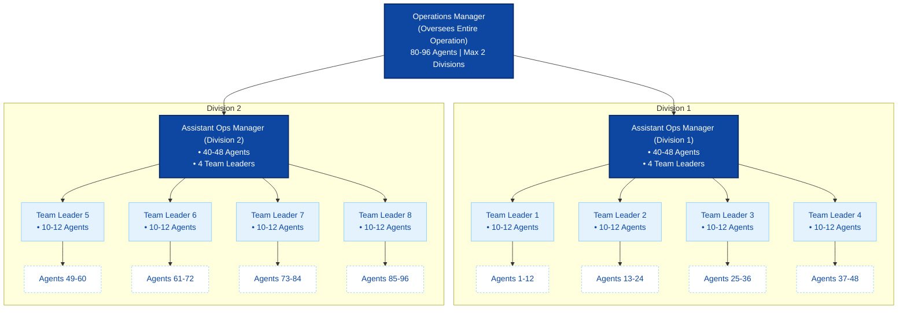
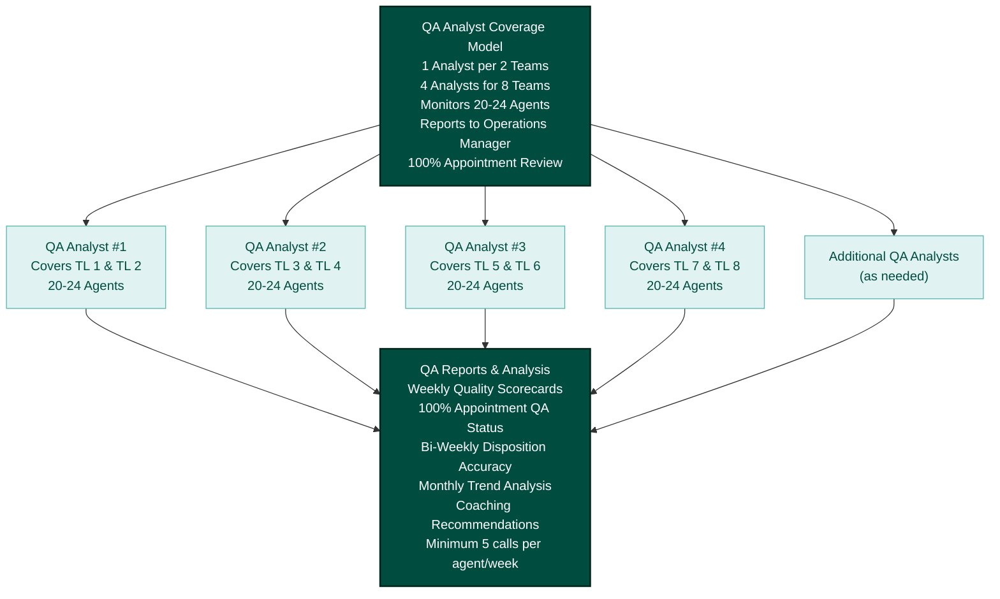
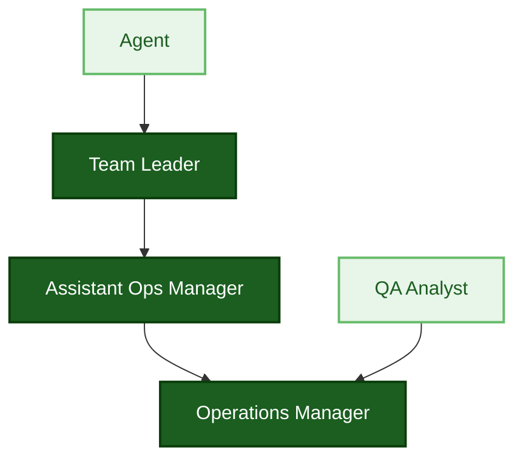
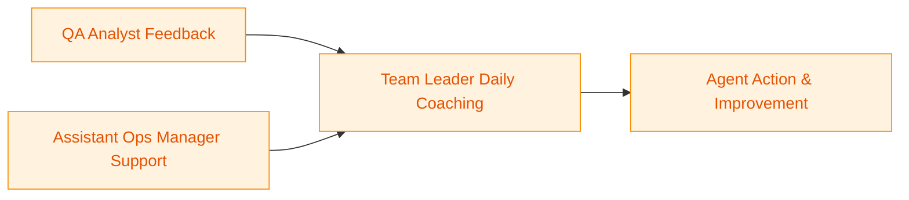
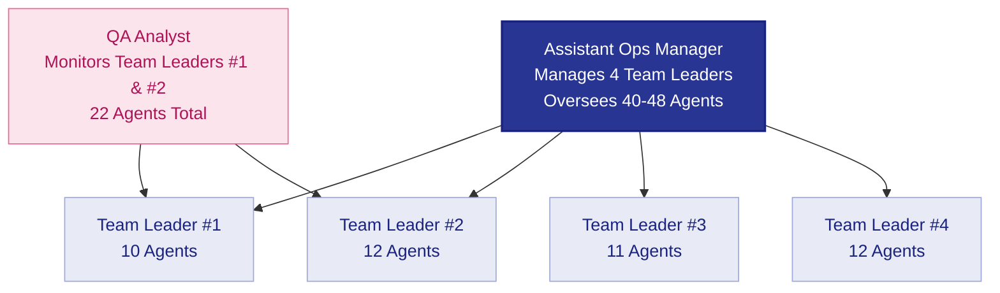
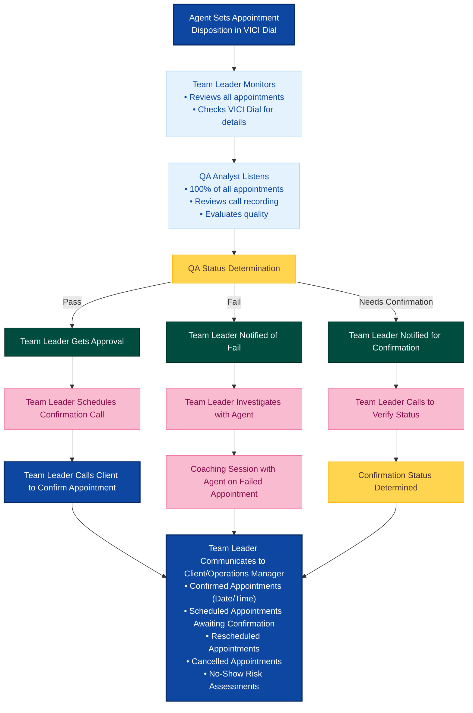
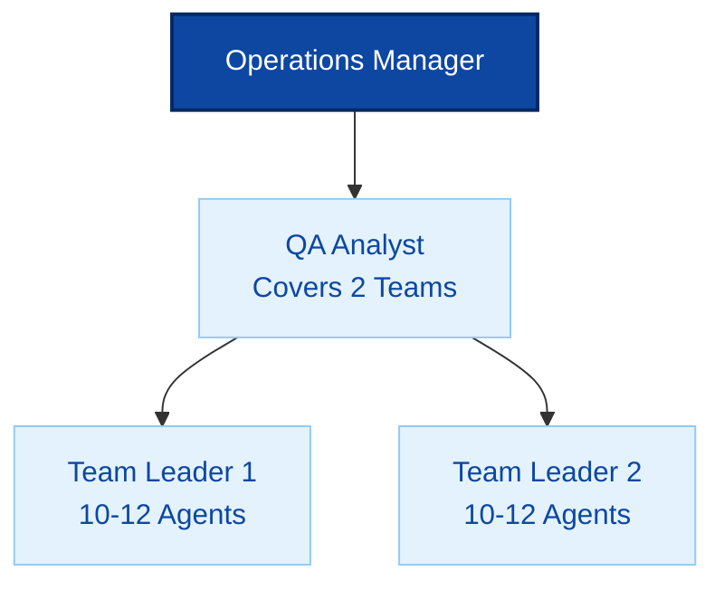

# Operational Hierarchy

## Table of Contents
- [Overview](#overview)
- [Organizational Structure](#organizational-structure)
- [Physical Call Center Model](#physical-call-center-model)
- [Virtual Call Center Model](#virtual-call-center-model)
- [Role Definitions](#role-definitions)
- [Coaching & Feedback Framework](#coaching--feedback-framework)
- [QA-Analyst Reporting Structure](#qa-analyst-reporting-structure)
- [Key Performance Metrics](#key-performance-metrics)

---

## Overview

This document outlines the operational hierarchy for both Physical and Virtual Call Center models, defining clear reporting structures, span of control, coaching frameworks, and quality assurance protocols.

---

## Organizational Structure

### Hierarchy Levels





### Span of Control Visual

| Role | Direct Supervision | Indirect Oversight | Notes |
| --- | --- | --- | --- |
| Operations Manager | Maximum 2 Assistant Ops Managers | 80-96 Agents | Oversees 8 teams across 2 divisions |
| Assistant Operations Manager | 4 Team Leaders | 40-48 Agents | Leads 1 division composed of 4 teams |
| Team Leader | 10-12 Agents | N/A | Leads a single team |
| QA Analyst | 2 Teams (20-24 Agents) | N/A | Reports directly to Operations Manager |





### Single Division Deep Dive



**QA Reporting Recipients:**
- Individual Agents (Teams 1 & 2)
- Team Leaders #1 and #2
- Assistant Operations Manager
- Operations Manager

---

## Physical Call Center Model

### Structure Overview

**Location:** Centralized office facility
**Team Configuration:** Co-located teams with direct supervision
**Span of Control:** Standard ratios maintained

### Hierarchy Breakdown

| Role | Supervises | Agent Count | Teams |
|------|-----------|-------------|-------|
| **Operations Manager** | Maximum 2 Assistant Ops Managers | 80-96 | 2 Divisions (8 Teams) |
| **Assistant Operations Manager** | 4 Team Leaders | 40-48 | 4 Teams |
| **Team Leader** | Direct Agent Supervision | 10-12 | 1 Team |
| **Agent** | N/A | - | - |
| **QA Analyst** | Monitors 2 Teams | 20-24 Agents | 2 Teams |

### Physical Call Center Characteristics

#### Workspace
- **Physical Environment:** Dedicated office space with workstations
- **Seating:** Fixed desk assignments or hot-desking
- **Supervision:** Visual monitoring and floor management
- **Accessibility:** On-site IT support and immediate assistance

#### Communication Methods
- **Team Meetings:** In-person huddles and briefings
- **Coaching Sessions:** Face-to-face 1-on-1 sessions in meeting rooms
- **Side-by-Side Coaching:** Real-time observation and immediate feedback
- **On-Spot Feedback:** Instant correction on the floor
- **Escalations:** Direct physical access to supervisors

#### Technology & Systems
- **Dialer Systems:** Centralized server-based systems
- **CRM Platforms:** Network-based applications
- **Quality Monitoring:** Centralized recording and monitoring systems
- **Communication:** Internal phone systems, instant messaging
- **Reporting Tools:** Shared dashboards and real-time floor displays

#### Supervision Approach
- **Visual Monitoring:** Direct observation of agent activity
- **Floor Walking:** Supervisors present on the call center floor
- **Immediate Intervention:** Quick response to issues
- **Team Dynamics:** Group motivation and team-building activities
- **Attendance Tracking:** Physical check-in systems

---

## Virtual Call Center Model

### Structure Overview

**Location:** Remote/distributed workforce
**Team Configuration:** Geographically dispersed teams
**Span of Control:** Same ratios as Physical model

### Hierarchy Breakdown

| Role | Supervises | Agent Count | Teams | Key Differences |
|------|-----------|-------------|-------|-----------------|
| **Operations Manager** | Maximum 2 Assistant Ops Managers | 80-96 | 2 Divisions (8 Teams) | Remote oversight via Teams/Discord |
| **Assistant Operations Manager** | 4 Team Leaders | 40-48 | 4 Teams | Virtual team management |
| **Team Leader** | Direct Agent Supervision | 10-12 | 1 Team | Remote coaching via Teams/Google Meet |
| **Agent** | N/A | - | - | Home-based workstation |
| **QA Analyst** | Monitors 2 Teams | 20-24 Agents | 2 Teams | Remote call monitoring + 100% Appts |

### Virtual Call Center Characteristics

#### Workspace
- **Physical Environment:** Home offices or remote locations
- **Equipment:** Company-provided or BYOD (Bring Your Own Device)
- **Supervision:** Digital monitoring and performance dashboards
- **Accessibility:** Remote IT support via ticketing systems

#### Communication Methods
- **Team Meetings:** Microsoft Teams, Google Meet, or Discord video calls
- **Coaching Sessions:** Virtual 1-on-1 sessions via Teams or Google Meet
- **Side-by-Side Coaching:** Screen sharing and call monitoring via Teams
- **On-Spot Feedback:** Discord or Teams instant messaging
- **Escalations:** Teams channels, Discord servers, email
- **Daily Check-ins:** Video stand-ups via Teams or Google Meet

#### Technology & Systems
- **Dialer Systems:** Cloud-based dialing platforms (VICI Dial, Five9, Talkdesk)
- **CRM Platforms:** Web-based SaaS applications
- **Quality Monitoring:** Cloud call recording and screen capture
- **Communication Tools:**
  - **Microsoft Teams:** Primary platform for meetings, chat, file sharing
  - **Discord:** Team coordination, quick chats, voice channels
  - **Google Meet:** Alternative video conferencing for clients
  - **VoIP Systems:** Cloud-based phone integration
- **Reporting Tools:** Cloud dashboards with remote access
- **Time Tracking:** Digital attendance and productivity monitoring (VICI Dial tracking)
- **VPN & Security:** Secure remote access protocols

#### Supervision Approach
- **Digital Monitoring:** Dashboard-based performance tracking
- **Scheduled Check-ins:** Regular video meetings and calls
- **Asynchronous Feedback:** Email, recorded video feedback
- **Self-Management:** Higher autonomy with accountability
- **Virtual Team Building:** Online activities and engagement programs
- **Time Zone Management:** Flexible scheduling across regions

---

## Role Definitions

### Operations Manager

**Reports To:** Executive Leadership / Director of Operations
**Supervises:** Assistant Operations Managers, QA Team

**Core Responsibilities:**
- Strategic oversight of all call center operations
- Performance management across all teams
- Budget and resource allocation
- Policy development and implementation
- Escalation point for critical issues
- Cross-functional collaboration with other departments
- Quality assurance program oversight
- Technology and system optimization

**Key Metrics:**
- Overall operational efficiency
- Customer satisfaction scores
- Revenue/appointment targets
- Agent retention rates
- Quality scores across all teams

---

### Assistant Operations Manager

**Reports To:** Operations Manager
**Supervises:** 4 Team Leaders (40-48 Agents total)

**Core Responsibilities:**
- Direct supervision of 4 Team Leaders
- Performance monitoring and coaching of Team Leaders
- Escalation management from Team Leaders
- Team performance analysis and reporting
- Implementation of operational strategies
- Coordination between teams
- Conducting leadership coaching sessions
- Resource allocation within assigned teams
- Identifying training needs and gaps

**Key Metrics:**
- Team productivity (across 4 teams)
- Quality scores for assigned teams
- Team Leader performance
- Agent retention within division
- Achievement of team targets

**Coaching Responsibilities:**
- Weekly 1-on-1s with each Team Leader
- Monthly performance reviews
- Leadership development coaching
- Observation and calibration sessions

---

### Team Leader

**Reports To:** Assistant Operations Manager
**Supervises:** 10-12 Agents

**Core Responsibilities:**
- Direct daily supervision of 10-12 agents
- Performance coaching and development
- Daily team huddles and briefings
- Real-time performance monitoring via VICI Dial
- Scheduling and attendance management
- First-line escalation point for agents
- Quality assurance at team level
- Individual agent coaching sessions
- Recognition and motivation
- Training coordination for new hires

**Appointment Management Responsibilities:**
- **Review ALL appointments** set by the team
- **Schedule confirmation calls** for each client
- **Coordinate with QA** on appointment quality status (Pass/Fail/Needs Confirmation)
- **Communicate client schedules** regarding:
  - Confirmed appointments
  - Scheduled appointments awaiting confirmation
  - Rescheduled or cancelled appointments
- **Monitor appointment show rates** and follow-up

**Agent Development Focus:**
- **Conduct focused coaching sessions** on one critical subject at a time
- **Primary Focus Area: Objection Handling**
- Mentoring agents on specific skill gaps
- Monitor VICI Dial for agent utilization and performance
- Collaborate with RTM (Real-Time Management) if needed
- Provide targeted feedback based on QA findings

**Key Metrics:**
- Team productivity and conversion rates
- Individual agent performance
- Team quality scores
- **Appointment confirmation rate**
- **Appointment show rate**
- Agent engagement and morale
- Schedule adherence
- Average handling time

**Coaching Responsibilities:**
- Daily on-spot feedback
- Weekly 1-on-1 coaching sessions with each agent focused on **Objection Handling**
- Side-by-side coaching (live call monitoring)
- Monthly performance reviews
- Corrective action plans when needed
- Post-appointment coaching for failed/needs confirmation cases

**Appointment Management Workflow Visual:**



---

### Agent

**Reports To:** Team Leader
**Supervises:** N/A

**Core Responsibilities:**
- Handling customer interactions (calls/chats/emails)
- Meeting individual performance targets
- Following scripts and compliance guidelines
- Accurate disposition and data entry
- Customer relationship management
- Appointment setting and qualification
- Adhering to schedule and break times
- Continuous learning and skill development
- Participating in coaching sessions

**Key Metrics:**
- Call/contact volume
- Conversion/appointment rate
- Quality scores
- Average handling time
- Customer satisfaction
- Schedule adherence
- First call resolution

---

### QA Analyst

**Reports To:** Operations Manager / QA Manager
**Coverage:** 1 QA Analyst per 2 Teams (20-24 Agents)

**Core Responsibilities:**
- Call monitoring and evaluation
- Quality scorecard completion
- Disposition accuracy analysis
- Trend identification and reporting
- Calibration sessions with Team Leaders
- Coaching recommendations
- Compliance monitoring
- Performance analytics and insights
- Creating QA reports and dashboards

**Key Deliverables:**
- Weekly quality reports
- Monthly disposition accuracy analysis
- Agent-specific feedback reports
- Trend analysis and recommendations
- Calibration session documentation

**Reporting Structure:**



**Reporting Frequency:**

| Report Type | Frequency | Recipients |
|-------------|-----------|------------|
| Individual Agent Quality Scorecards | Weekly | Agent, Team Leader |
| Team Quality Summary | Weekly | Team Leader, Asst Ops Manager |
| Disposition Accuracy Report | Bi-weekly | Team Leaders, Ops Manager |
| Monthly QA Trends & Analysis | Monthly | All Leadership |
| Calibration Session Notes | After Each Session | Team Leaders, Ops Manager |

---

## Coaching & Feedback Framework

### Coaching Session Types

Based on the Effective Coaching methodology, the following coaching approaches are utilized:

#### 1. On-Spot Feedback

**Description:** Quick, immediate feedback given during or right after an interaction

**Use Case:**
- Real-time correction during live calls (side-by-side)
- Immediate positive reinforcement
- Quick highlights of opportunities

**Characteristics:**
- Informal and brief
- Focused on specific behavior
- Not documented extensively
- Occurs on the floor or via IM in virtual settings

**Best Practices:**
- Be specific and timely
- Focus on one behavior
- Use positive language
- Provide actionable guidance

---

#### 2. Formal 1-on-1 Coaching Session

**Description:** Structured coaching meeting following the 8-step coaching framework

**Use Case:**
- Performance improvement needed
- Skill development
- Addressing recurring issues
- Goal setting and development

**Duration:** 30-45 minutes

**Frequency:**
- **Minimum:** Weekly for all agents
- **Performance Issues:** 2-3 times per week
- **New Hires:** Daily for first 2 weeks, then 3x/week

**8-Step Coaching Framework:**

| Step | Duration | Focus | Key Actions |
| --- | --- | --- | --- |
| 1. Ice Breaking | 5 minutes | Create comfortable environment | Positive, friendly opening; brief non-work conversation; build rapport and trust |
| 2. Discovery | 5 minutes | Diagnose performance opportunities | Identify root causes; review call recordings/metrics; highlight strengths and opportunities with specific examples |
| 3. Listening & Containing | 5-7 minutes | Understand agent perspective | Allow agent to vent; practice active listening; show genuine empathy; acknowledge viewpoints |
| 4. Education | 8-10 minutes | Collaboratively build solutions | Discuss improvement opportunities; co-create solutions; confirm understanding; role-play scenarios and leverage learning tools |
| 5. S.M.A.R.T Technique | 5-7 minutes | Establish goals | Define Specific, Measurable, Achievable, Relevant, and Time-bound commitments |
| 6. Ensure Understanding | 3-5 minutes | Validate clarity | Ask probing questions; recap key points; adjust educational tools as needed; confirm comprehension |
| 7. Coaching Effectiveness | 2-3 minutes | Confirm expectations | Clarify session length; align on outcomes; schedule follow-up; document agreements |
| 8. Praise / Action | 2-3 minutes | Motivate and close | Send recognition; outline motivational action plan; reinforce positive behaviors; set corrective actions if needed |

**Session Closeout Checklist:**
- Documentation filed
- Follow-up scheduled
- Agent acknowledgment captured

**Documentation Required:**
- Coaching session form
- Action plan with SMART goals
- Follow-up dates
- Agent acknowledgment

---

#### 3. Side-by-Side Coaching

**Description:** Real-time observation and coaching during live customer interactions

**Use Case:**
- New hire training
- Skill reinforcement
- Performance improvement
- Quality issue identification

**Methodology:**

**Physical Model:**
- Team Leader sits next to agent
- Listens to live calls
- Provides notes during call
- Immediate debrief after each interaction

**Virtual Model:**
- Screen sharing and call monitoring
- Real-time chat feedback
- Post-call video debrief
- Recorded session review

**Best Practices:**
- Limit to 1-2 hours per session
- Focus on 2-3 specific skills
- Provide written notes
- Balance positive and constructive feedback

---

#### 4. Corrective Coaching Session

**Description:** Formal session addressing performance or behavioral issues

**Use Case:**
- Policy violations
- Persistent performance issues
- Attendance or adherence problems
- Quality failures

**Structure:**

| Step | Focus | Key Activities |
| --- | --- | --- |
| 1. Opening the Meeting | Set tone and purpose | State purpose clearly and professionally; use non-accusatory language; create a safe environment; reference specific reason for discussion |
| 2. Getting Agreement | Align on current state | Specify behavior using data and examples; clarify expectations; outline consequences; confirm agent understanding and agreement |
| 3. Exploring Alternatives | Co-create solutions | Acknowledge agent suggestions; evaluate benefits/drawbacks; contribute additional options; identify root causes together |
| 4. Getting Commitment to Act | Secure action plan | Ask probing and closed questions; encourage dialogue; set S.M.A.R.T targets; document mutual commitments |
| 5. Handling Excuses (as needed) | Address resistance | Rephrase misunderstandings; reset expectations; use corrective yet professional language; remain calm and non-defensive |
| 6. Closing the Meeting | Finalize plan | Summarize discussion; review action items; confirm understanding; document agreement; schedule follow-up; close professionally |

**Corrective Action Plan Requirements:**
- Documented plan on file
- Agent signature obtained
- Follow-up date scheduled
- HR notified when escalation is required

**Documentation:**
- Formal coaching form
- Performance improvement plan (PIP) if applicable
- Clear consequences outlined
- Follow-up schedule
- HR notification if escalated

---

### Coaching Action Plan Template

Every coaching session must include a documented action plan:

| Element | Description |
|---------|-------------|
| **PROBLEM ID** | The specific issue identified |
| **ROOT CAUSE** | Underlying reasons causing the issue |
| **ACTION STEPS** | Specific steps to resolve the issue |
| **OWNER** | Who is responsible (Agent, TL, both) |
| **MEASUREMENT TOOL** | How effectiveness will be measured |
| **DEADLINE** | When follow-up/resolution is expected |

**S.M.A.R.T Goals:**
- **Specific:** What exactly will be accomplished?
- **Measurable:** How will you know it's effective?
- **Achievable:** Can it realistically be achieved?
- **Relevant:** Is it relevant to the issue?
- **Timed:** What is the deadline?

---

### Handling Different Participant Types

Based on personality and engagement levels, different coaching approaches are needed:

#### The Shy or Quiet Participant

**Behaviors:**
- Avoids eye contact
- Hesitant to speak
- Stays silent
- Gets stressed easily

**Coaching Approach:**
- Don't use a tone of blame
- Listen actively
- Boost their confidence
- Include them in varied tasks
- Create safe space for input

---

#### The Know-It-All Participant

**Behaviors:**
- Poor listening skills
- Constantly arguing
- Condescending attitude
- Ego-centric
- Impulsive

**Coaching Approach:**
- Avoid arguing
- Give constructive feedback
- Be understanding
- Lead by example
- Don't take it personally
- Set clear expectations

---

#### The Unfocused Participant

**Behaviors:**
- Easily distracted
- Frequently fidgeting
- Lacks attention
- Asks to repeat information

**Coaching Approach:**
- Be considerate
- Encourage feedback
- Ask for their suggestions
- Make sessions interesting and interactive
- Use visual aids
- Keep sessions concise

---

#### The Super-Achiever Participant

**Behaviors:**
- Highly committed
- Hunger for accomplishment
- Self-motivated
- Focused on priorities
- Confident

**Coaching Approach:**
- Demonstrate empathy
- Provide continuous feedback
- Lead by example
- Avoid letting ego interfere
- Challenge them with growth opportunities
- Recognize achievements

---

#### The Joker Participant

**Behaviors:**
- Jokes frequently
- Doesn't stay focused
- Frequent interruptions
- Likes gossip

**Coaching Approach:**
- Set clear boundaries
- Highlight benefits and importance
- Don't be afraid to be firm
- Redirect to topic
- Use humor appropriately but maintain control

---

#### The Argumentative Participant

**Behaviors:**
- Usually objects
- Defensive
- Blames others
- Gives many excuses
- Demotivated

**Coaching Approach:**
- Offer alternatives
- Get them involved in solution
- Agree on at least one point
- Motivate and encourage
- Ensure understanding
- Document agreements

---

## QA-Analyst Reporting Structure

### Reporting Hierarchy

```mermaid
flowchart TD
    classDef leader fill:#0d47a1,color:#ffffff,stroke:#062863,stroke-width:2px
    classDef support fill:#e3f2fd,color:#0d47a1,stroke:#90caf9

    OM[Operations Manager]:::leader --> QA[QA Analyst<br/>Coverage: 2 Teams (20-24 Agents)]:::support
    OM --> AOM[Assistant Ops Manager<br/>Supervises 4 Team Leaders]:::support
    QA --> TL1[Team Leader 1<br/>10-12 Agents]:::support
    QA --> TL2[Team Leader 2<br/>10-12 Agents]:::support
    AOM --> TL3[Team Leader 3<br/>10-12 Agents]:::support
    AOM --> TL4[Team Leader 4<br/>10-12 Agents]:::support
    AOM --> TL5[Team Leader 5<br/>10-12 Agents]:::support
    AOM --> TL6[Team Leader 6<br/>10-12 Agents]:::support
```

### QA Coverage Model

**Ratio:** 1 QA Analyst : 2 Teams (20-24 Agents)

**Monitoring Requirements:**

**Core Requirements:**
- **Minimum 5 calls per agent per week** from each disposition category
- **100% of ALL appointments** must be listened to and QA'd
- **100% of escalated calls** reviewed
- **Random sampling** for quality assurance across all call types

**Appointment Quality Process:**
- Listen to every appointment call
- Submit appointment QA status: **[Pass, Fail, Needs Confirmation]**
- Flag appointments requiring verification
- Coordinate with Team Leaders on failed/questionable appointments

---

### QA Reports & Frequency

#### 1. Weekly Quality Scorecards

**Frequency:** Every Monday for previous week
**Recipients:** Individual Agents, Team Leaders, Assistant Ops Manager

**Contents:**
- Individual agent scores (0-100%)
- Quality criteria breakdown
- Specific call examples (good and poor)
- Improvement recommendations
- Comparison to previous week

**Metrics Evaluated:**
- Greeting and introduction
- Needs assessment
- Product knowledge
- Objection handling
- Closing and appointment setting
- Compliance adherence
- Professionalism and tone
- Accuracy of information

---

#### 2. Team Quality Summary Report

**Frequency:** Weekly
**Recipients:** Team Leaders, Assistant Ops Manager, Operations Manager

**Contents:**
- Team average quality score
- Top and bottom performers
- Common quality issues
- Training needs identified
- Week-over-week trends
- Comparison to other teams

---

#### 3. Disposition Accuracy Analysis

**Frequency:** Bi-weekly
**Recipients:** Team Leaders, Operations Manager

**Purpose:** Ensure agents are correctly categorizing call outcomes

**Contents:**
- Disposition error rate by agent
- Common misclassification patterns
- Impact on reporting accuracy
- Recommended corrections
- Training needs

**Key Dispositions Analyzed:**
- Appointments set
- Callbacks scheduled
- Not interested
- Wrong number
- Do not call
- Language barrier

---

#### 4. Monthly QA Trends & Analysis

**Frequency:** First week of each month
**Recipients:** All Leadership (Ops Manager, Asst Ops Managers, Team Leaders)

**Contents:**
- Month-over-month quality trends
- Campaign-specific quality insights
- Top quality issues across all teams
- Success stories and best practices
- Recommended focus areas for next month
- Training curriculum suggestions
- Quality improvement initiatives

---

#### 5. Calibration Session Notes

**Frequency:** Monthly or after each calibration session
**Recipients:** Team Leaders, Operations Manager

**Purpose:** Ensure consistency in quality evaluation across teams

**Contents:**
- Calls reviewed during calibration
- Score alignment discussion
- Criteria clarification
- Updates to quality standards
- Action items for consistent evaluation

---

### Disposition Accuracy Standards

| Call Outcome | Accuracy Target | Review Frequency |
|--------------|-----------------|------------------|
| Appointment Set | 98%+ | Weekly |
| Callback Scheduled | 95%+ | Weekly |
| Not Interested | 90%+ | Bi-weekly |
| Wrong Number | 95%+ | Bi-weekly |
| Do Not Call | 100% | Weekly |
| Language Barrier | 90%+ | Monthly |

---

## Key Performance Metrics

### Individual Agent KPIs

| Metric | Target | Measurement Frequency |
|--------|--------|----------------------|
| **Conversion Rate** | 8-12% (varies by campaign) | Daily |
| **Talk Time** | 3-5 minutes average | Daily |
| **Calls Per Hour** | 15-25 (varies by campaign) | Daily |
| **Quality Score** | 85%+ | Weekly |
| **Schedule Adherence** | 95%+ | Daily |
| **Attendance** | 95%+ | Weekly |
| **Customer Satisfaction** | 4.0+/5.0 | Weekly |

---

### Team Leader KPIs

| Metric | Target | Measurement Frequency |
|--------|--------|----------------------|
| **Team Conversion Rate** | 10%+ | Daily |
| **Team Quality Average** | 87%+ | Weekly |
| **Agent Retention** | 90%+ | Monthly |
| **Coaching Sessions Completed** | 100% of required sessions | Weekly |
| **Schedule Adherence** | 95%+ team average | Daily |
| **Agent Development** | Measurable improvement | Monthly |

---

### Assistant Operations Manager KPIs

| Metric | Target | Measurement Frequency |
|--------|--------|----------------------|
| **Division Conversion Rate** | 10%+ across 4 teams | Daily |
| **Division Quality Average** | 88%+ | Weekly |
| **Team Leader Development** | Measurable improvement | Monthly |
| **Agent Retention** | 85%+ | Monthly |
| **Escalation Resolution Time** | <24 hours | Weekly |
| **Team Performance Consistency** | <10% variance between teams | Weekly |

---

### Operations Manager KPIs

| Metric | Target | Measurement Frequency |
|--------|--------|----------------------|
| **Overall Conversion Rate** | 10-12% | Daily |
| **Overall Quality Score** | 88%+ | Weekly |
| **Agent Retention** | 85%+ | Monthly |
| **Cost Per Acquisition** | Campaign-specific | Monthly |
| **Customer Satisfaction** | 4.2+/5.0 | Monthly |
| **Operational Efficiency** | Revenue per FTE | Monthly |

---

### QA Analyst KPIs

| Metric | Target | Measurement Frequency |
|--------|--------|----------------------|
| **Calls Monitored** | 5+ per agent/week | Weekly |
| **Report Delivery** | 100% on-time | Weekly |
| **Calibration Sessions** | 1 per month minimum | Monthly |
| **Disposition Accuracy** | 95%+ across all teams | Bi-weekly |
| **Quality Trend Identification** | Actionable insights | Monthly |

---

## Model Comparison Summary

### Physical vs Virtual Call Center

| Aspect | Physical Call Center | Virtual Call Center |
|--------|---------------------|---------------------|
| **Workspace** | Office facility | Home/remote offices |
| **Supervision** | Visual floor management | Dashboard monitoring |
| **Communication** | In-person, phone | Video, chat, VoIP |
| **Coaching** | Face-to-face sessions | Virtual sessions via video |
| **Side-by-Side** | Physical presence | Screen sharing |
| **On-Spot Feedback** | Floor-based | IM/chat-based |
| **Team Meetings** | Conference rooms | Video conferencing |
| **Technology** | Server-based systems | Cloud-based platforms |
| **IT Support** | On-site | Remote ticketing |
| **Monitoring** | Direct observation | Digital dashboards |
| **Team Building** | In-person activities | Virtual engagement |
| **Span of Control** | 10-12 agents per TL | 10-12 agents per TL |
| | 40-48 agents per Asst Mgr | 40-48 agents per Asst Mgr |

---

## Quick Reference Guide

### Complete Operational Flow

#### Leadership Structure

| Role | Supervises | Coverage | Key Focus |
| --- | --- | --- | --- |
| Operations Manager | Maximum 2 Assistant Ops Managers | 80-96 Agents | Strategic oversight, performance, budget management |
| Assistant Operations Manager (Per Division) | 4 Team Leaders | 40-48 Agents | Team performance, TL coaching, resource allocation |
| Team Leader (Per Team) | 10-12 Agents | 1 Team | Daily supervision, coaching, performance monitoring |
| QA Analyst | 2 Teams (20-24 Agents) | 20-24 Agents | Quality monitoring, reporting, coaching recommendations |

#### Coaching Framework

| Session Type | Purpose | Duration | Frequency | Documentation |
| --- | --- | --- | --- | --- |
| On-Spot Feedback | Real-time, immediate corrections | 1-3 minutes | As needed | Not typically documented |
| Formal 1-on-1 | Structured 8-step coaching | 30-45 minutes | Weekly minimum | Coaching session form required |
| Side-by-Side | Live call monitoring & coaching | 1-2 hours | Bi-weekly or as needed | Notes captured in coaching log |
| Corrective Session | Performance/behavior issues | 30-60 minutes | As needed | Formal documentation required |

#### QA Reporting Cycle

| Cadence | Deliverables |
| --- | --- |
| Daily | Real-time call monitoring; On-spot quality observations |
| Weekly | Individual quality scorecards; Team quality summary reports |
| Bi-Weekly | Disposition accuracy analysis |
| Monthly | QA trends & analysis reports; Calibration sessions with Team Leaders |

#### Key Performance Indicators

| Level | KPI | Target |
| --- | --- | --- |
| Agent | Conversion Rate | 8-12% |
| Agent | Quality Score | 85%+ |
| Agent | Schedule Adherence | 95%+ |
| Agent | Calls Per Hour | 15-25 (campaign dependent) |
| Team Leader | Team Conversion | 10%+ |
| Team Leader | Team Quality Average | 87%+ |
| Team Leader | Coaching Completion | 100% |
| Team Leader | Agent Retention | 90%+ |
| Operations | Overall Conversion | 10-12% |
| Operations | Overall Quality | 88%+ |
| Operations | Agent Retention | 85%+ |
| Operations | Customer Satisfaction | 4.2+/5.0 |

#### Physical vs Virtual Models

**Identical Elements:** Reporting structure (all levels); Span of control ratios; Coaching framework and methodology; KPIs and performance standards; QA coverage model.

| Aspect | Physical Model | Virtual Model |
| --- | --- | --- |
| Workspace | Office facility | Remote/home offices |
| Monitoring | Visual monitoring | Dashboard monitoring |
| Meetings | In-person meetings | Video conferencing |
| Systems | Server-based systems | Cloud-based platforms |
| Supervision | Direct floor supervision | Digital supervision tools |


---

## Conclusion

This operational hierarchy framework provides clear structure, accountability, and performance standards for both Physical and Virtual Call Center models. While the core reporting structure and span of control remain consistent across both models, the tools, technologies, and supervision methods are adapted to fit the operational environment.

**Key Success Factors:**
- Clear reporting lines and accountability
- Consistent coaching and feedback
- Data-driven decision making through QA insights
- Adaptable leadership across physical and virtual settings
- Focus on agent development and retention
- Performance metrics aligned with business objectives

---

**Document Version:** 1.0
**Last Updated:** 2025-11-13
**Review Frequency:** Quarterly or as operational needs change

